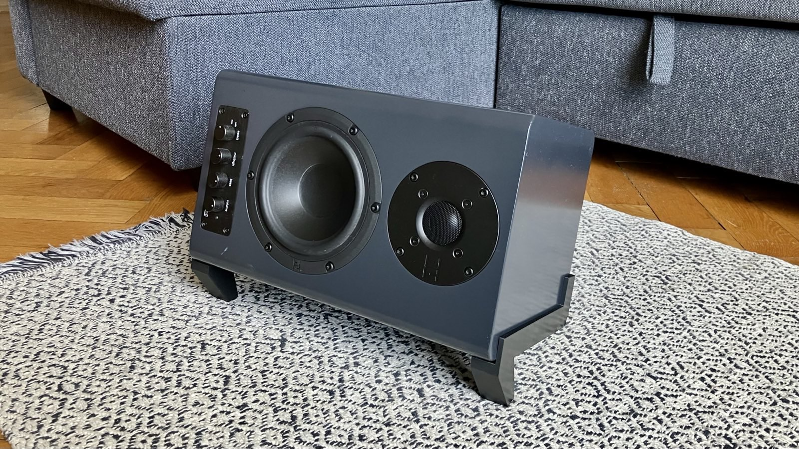

# dìyījí

**dìyījí** (第一级）is an open source audio-monitor stand for you desk. It incorperates monitors into becoming two tiny desks, maybe addind a another, a first floor to your desk, while improving your audio experience. The monitor and wooden top plate are vibration-decoupled through thin rubber linings to no obstruct audio. *dìyījí* can be 3D printed and comes as a customizeable OpenSCAD script. Slanting-angle and edge-radius are available as global variables, allowing fast adaptation.

<table>
  <tbody>
    <tr>
      <td>
        
      </td>
      <td>
        
      </td>
    </tr>
    <tr>
      <td colspan="2">
        
      </td>
    </tr>
    <tr>
      <td colspan="2">
        
      </td>
    </tr>
    <tr>
      <td>
        
      </td>
      <td>
        
      </td>
    </tr>
  </tbody>
</table>

## Notes

- *dìyījí* has been designed for and printed on a Prusa Mini+
- it can be fully printed with no support structure
- the script adds 1mm clearance for ~1-1.5mm thick rubber lining, such can be bought at hardware stores
- please add two stripes of the lining to the inside, also following the bend part
- please also add rubber strips to the two desk-touching parts
- everything is held together by gravity, print the parts, add rubber lining, assemble and let gravity do the rest
- you can leave out the upper parts if you not desire to put something ontop

